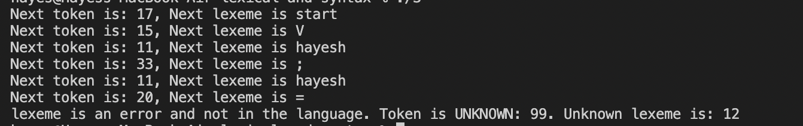
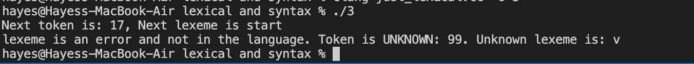
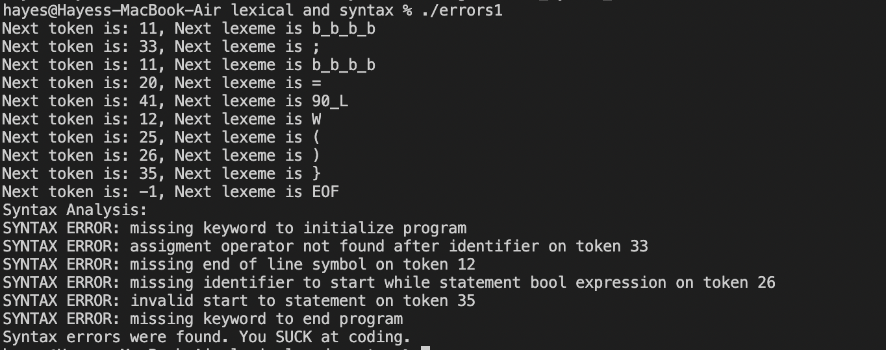
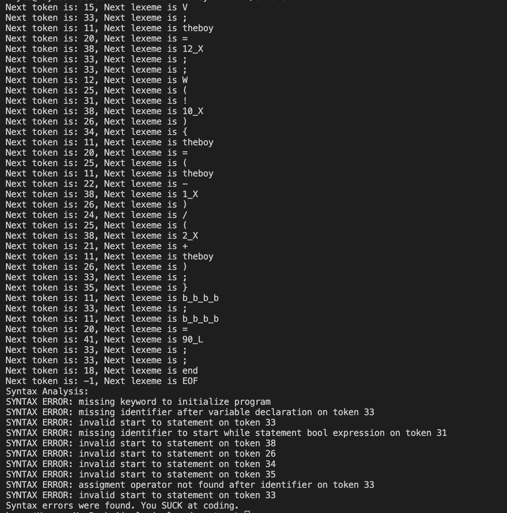
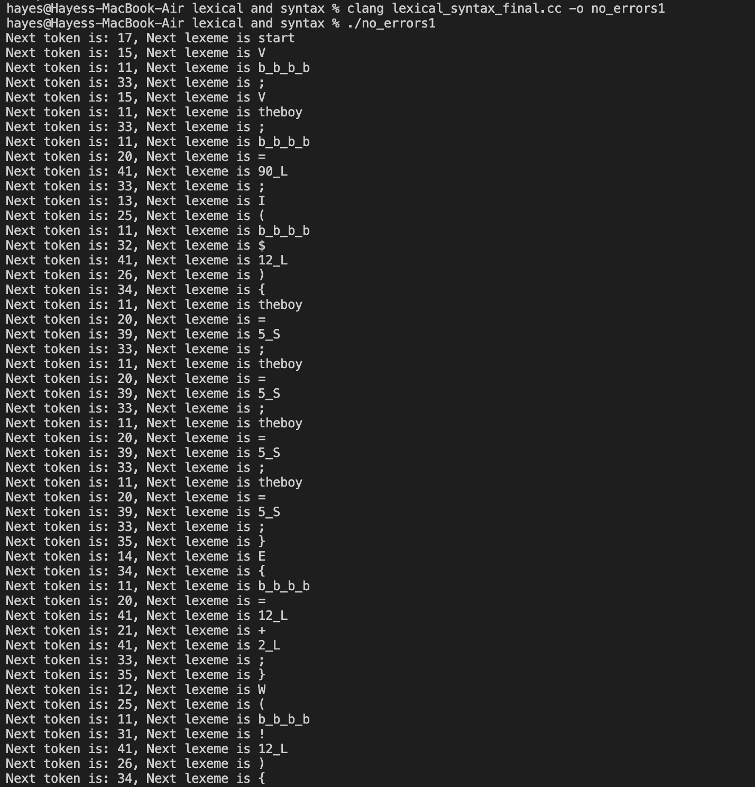
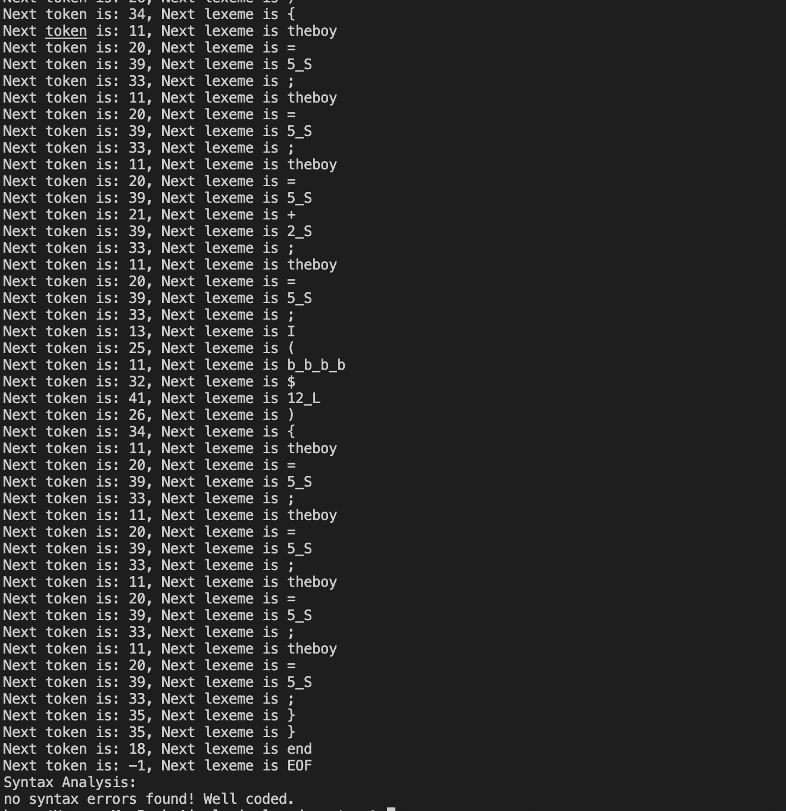
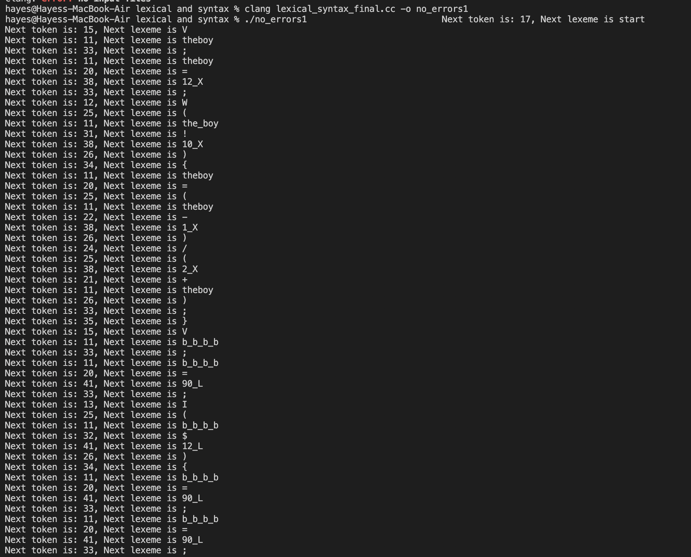
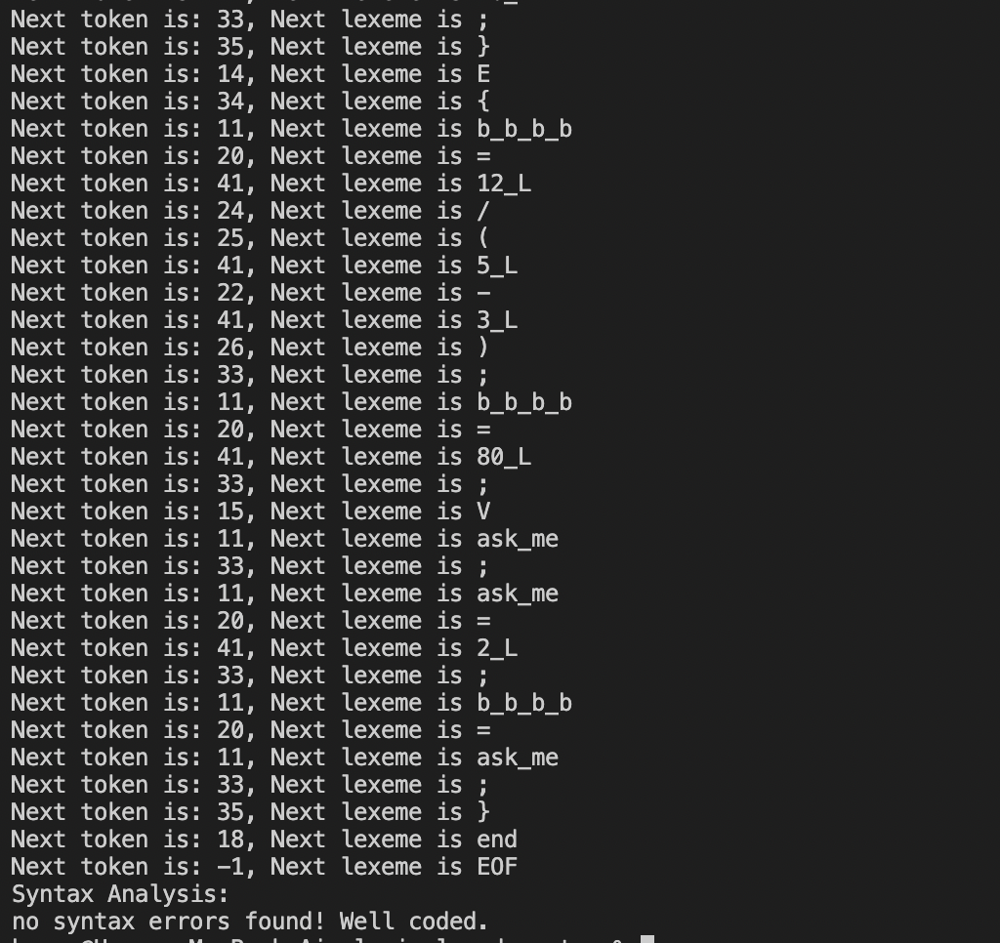

# PLC-TEST-2

## a.
Addition regex: +
Subtraction regex: -
Multiplication regex: *
Division regex: /
Modulus regex: %
Less than regex: <
Greater than regex: >
Less than or equal to regex: @
Greater than or equal to regex: #
Equal to regex: $
Not equal to regex: ! 
Assignment regex: =
Break precedence start regex: (
Break precedence end regex: )
Variable names regex: [a-z_] [a-z_] [a-z_] [a-z_] [a-z_] [a-z_] [a-z_]? [a-z_]?

Variable type regex: V
If statement regex: I
Else statement regex: E
While statement regex: W

Different int sizes regex:
1 byte: [0-9]+_X
2 byte: [0-9]+_S
4 byte: [0-9]+_M
8 byte: [0-9]+_L

## b.

`<prog> —> start <stmt_list> stop \n
<stmt_list> { <stmt> ; } \n
<stmt> —> <if_stmt> | <while_stmt> | <assignment> | <block> | <declare> \n
<declare> —> V id ;\n
<block> —> {  <stmt_list>  }\n
<if_stmt> —> I  (  <bool_exp>  )  <block> [ E <block> ]\n
<while_stmt> —> W  (  <bool_exp>  )  <block>\n
<assignment> —> id = <expression> ;\n
<expression> —> <term> { (  *  | /  | % ) <term> }\n
<term> —> <factor> { ( + | - ) <factor> }\n
<factor> —>   id  | int_lit  | ( <expression> )\n
\n
<bool_exp> —> <brel> { ( ! | $ ) <brel> }\n
<brel> —> <bexpr> { ( @ | # | < | > ) <bexpr> }\n
<bexpr> —> <bterm>  {  ( * | / | % ) <bterm> }\n
<bterm> —> <bfactor> { ( + | - ) <bfactor> }\n
<bfactor> —> id | int_lit | bool_lit | (  <bexpr> )\n `

## c.
Pass PDT:
FIRST(prog) = {start}
FIRST(stmt_list) = {I, W, id, {, V}
FIRST(expression) = {id, int_lit, ( }
FIRST(bool_exp) = {id, int_lit, bool_lit, ( } 

/* excluding non-terminals that are covered in the recursion down the statements */

## d.
Ambiguous: There can only be one path for my production rules. For example, the program can only start with the keyword start, and this only comes from the first rule. Likewise, the while keyword W can only be reached from the while_stmt rule, so there is only one way to generate this particular rule. The same is true of the symbol { being only created by the block rule which can only be accessed through the rules for if_stmt and while_stmt. The same is true for = only being accessed through the assignment rule, and so on. Thusly, there is no ambiguity in my language.

## e.
(see file: just_lexical.cc)

## f.
(see file: lexical_syntax_final.cc)

## g.
(see files: lexical_error1.in, lexical_error2.in, syntax_error1.in, syntax_error2.in, no_errors1.in, no_errors2.in)

### Lexical errors file 1 terminal output:

### Lexical errors file 2 terminal output:

### Syntax errors file 1 terminal output:

### Syntax errors file 2 terminal output:

### No errors file 1 terminal output:

### No errors file 2 terminal output:

