# PLC-TEST-2

## a.
Addition regex: +\
Subtraction regex: -\
Multiplication regex: *\
Division regex: /\
Modulus regex: %\
Less than regex: <\
Greater than regex: >\
Less than or equal to regex: @\
Greater than or equal to regex: #\
Equal to regex: $\
Not equal to regex: ! \
Assignment regex: =\
Break precedence start regex: (\
Break precedence end regex: )\
Variable names regex: [a-z_] [a-z_] [a-z_] [a-z_] [a-z_] [a-z_] [a-z_]? [a-z_]?

Variable type regex: V\
If statement regex: I\
Else statement regex: E\
While statement regex: W

Different int sizes regex:\
1 byte: [0-9]+_X\
2 byte: [0-9]+_S\
4 byte: [0-9]+_M\
8 byte: [0-9]+_L

## b.

`<prog> —> start <stmt_list> stop `\
`<stmt_list> { <stmt> ; } `\
`<stmt> —> <if_stmt> | <while_stmt> | <assignment> | <block> | <declare> `\
`<declare> —> V id ;`\
`<block> —> {  <stmt_list>  }`\
`<if_stmt> —> I  (  <bool_exp>  )  <block> [ E <block> ]`\
`<while_stmt> —> W  (  <bool_exp>  )  <block>`\
`<assignment> —> id = <expression> ;`\
`<expression> —> <term> { (  *  | /  | % ) <term> }`\
`<term> —> <factor> { ( + | - ) <factor> }`\
`<factor> —>   id  | int_lit  | ( <expression> )`\
\
`<bool_exp> —> <brel> { ( ! | $ ) <brel> }`\
`<brel> —> <bexpr> { ( @ | # | < | > ) <bexpr> }`\
`<bexpr> —> <bterm>  {  ( * | / | % ) <bterm> }`\
`<bterm> —> <bfactor> { ( + | - ) <bfactor> }`\
`<bfactor> —> id | int_lit | bool_lit | (  <bexpr> )`

## c.
Pass PDT:\
FIRST(prog) = {start}\
FIRST(stmt_list) = {I, W, id, {, V}\
FIRST(expression) = {id, int_lit, ( }\
FIRST(bool_exp) = {id, int_lit, bool_lit, ( } 

/* excluding non-terminals that are covered in the recursion down the statements */

## d.
Ambiguous: There can only be one path for my production rules. For example, the program can only start with the keyword start, and this only comes from the first rule. Likewise, the while keyword W can only be reached from the while_stmt rule, so there is only one way to generate this particular rule. The same is true of the symbol { being only created by the block rule which can only be accessed through the rules for if_stmt and while_stmt. The same is true for = only being accessed through the assignment rule, and so on. Thusly, there is no ambiguity in my language.

## e.
(see file: just_lexical.cc)

## f.
(see file: lexical_syntax_final.cc)

## g.
(see files: lexical_error1.in, lexical_error2.in, syntax_error1.in, syntax_error2.in, no_errors1.in, no_errors2.in)

### Lexical errors file 1 terminal output:

#### Lexical errors file 1 contents and explanation:

`start` (correct)\
`V hayesh;` (correct)\
`hayesh = 12;` (12 is not in language. Must be followed by suffix for byte, short, int, or long)\
`V i_d_i;` (i_d_i is too short to be an identifier, must be between 6-8 characters/underscores)\
`V HayesH;` (HayesH is not a valid identifier. it has capital letters which are not allowed to be present in variable identifiers)\
`IP (i_d_i_d_d ^ 12_X){` (IP is not a keyword in language, the keyword should be I for if statement, and ^ is not a operator symbol in the language )\
    `i_d_i_d = 12_H + 13_H;` (12_H and 13_H are not valid numbers because suffixes are not matching those defined for byte, short, int and long)\
`}` (correct)\
`en` (en is not a keyword and it is too short to be a variable identifier. The keyword for end of file is end)

### Lexical errors file 2 terminal output:

#### Lexical errors file 2 contents and explanation:

`start` (correct)\
`v hayesh;` (v is not a keyword in language and too short to be a variable identifier. Should be V)\
`12_` (missing suffix for byte, short, int, or long)\
`hayesh = 12;` (12 is missing suffix for byte, short, int, or long)\
`V i_d_i;` (i_d_i is only 5 characters/underscores so it is too short to be a variable identifier)\
`V HayesH;` (HayesH cannot be variable identifier because it has capital letters. Only lowercase letters are allowed for variable names)\
`P [ THEBOY ! 12_X ] {` (P is not a keyword, and \[ and ] are not symbols in the language)
    
`}` (correct)\
`endd` (endd is too short to be a variable name and not a keyword, should be end)

### Syntax errors file 1 terminal output:

#### Syntax errors file 1 contents and explanation:

(missing keyword start to start program)\
`b_b_b_b;` (missing V for variable declaration)\
`b_b_b_b = 90_L` (missing semicolon)\
`W ()` (missing identifier right after open paren)\
(missing boolean operator after identifier)\
(missing arithemetic expression after boolean operator)\
(missing opening brace for start of codeblock)\
`}` (correct)
(missing keyword to end program)

### Syntax errors file 2 terminal output:

#### Syntax errors file 2 contents and explanation:
(missing keyword start to start program)\
`V ;`
`theboy = 12_X; ;` (missing V for variable declaration)\
(missing variable name for variable declaration)\
`W (! 10_X){` (missing identifier that should come after first open paren)\
    `theboy = (theboy - 1_X) / (2_X + theboy);` (correct)\
`}` (correct)\
`b_b_b_b;` (missing keyword V for variable declaration)\
`b_b_b_b = 90_L; ;` (extra semicolon)\
(missing V keyword for variable declaration)\
(missing variable name for variable declaration)\
`end` (correct)

### No errors file 1 terminal output:

### No errors file 2 terminal output:

## h.

The go-to rules are too long to take screenshots of. No matter how far I zoom out my screen, it is still impossible to capture them, so take the rules below and paste them into the LR(1) generator to see the full list of go-to rules.

### RULES:
S' -> start STMT_LIST stop\
STMT_LIST -> STMT \
STMT -> IF_STMT\
STMT -> WHILE_STMT\
STMT -> ASS\
STMT -> BLOCK\
STMT -> DEC\
DEC -> v id ;\
BLOCK -> { STMT_LIST }\
IF_STMT -> i ( BOOL_EXP ) BLOCK\
IF_STMT -> i ( BOOL_EXP ) BLOCK e BLOCK \
WHILE_STMT -> w ( BOOL_EXP ) BLOCK\
ASS -> id = EXP ;\
EXP -> TERM\
EXP -> TERM * TERM\
EXP -> TERM / TERM\
EXP -> TERM % TERM\
TERM -> FACTOR\
TERM -> FACTOR + FACTOR\
TERM -> FACTOR - FACTOR
FACTOR -> id\
FACTOR -> int_lit\
FACTOR -> ( EXP )\
BOOL_EXP -> BEXP ! BEXP\
BOOL_EXP -> BEXP $ BEXP\
BOOL_EXP -> BEXP @ BEXP\
BOOL_EXP -> BEXP # BEXP\
BOOL_EXP -> BEXP < BEXP\
BOOL_EXP -> BEXP > BEXP\
BEXP -> BTERM\
BEXP -> BTERM * BTERM\
BEXP -> BTERM / BTERM\
BEXP -> BTERM % BTERM\
BTERM -> BFACTOR\
BTERM -> BFACTOR + BFACTOR\
BTERM -> BFACTOR - BFACTOR\
BFACTOR -> id\
BFACTOR -> int_lit\
BFACTOR -> bool_lit\
BFACTOR -> ( BEXP )

### LR TABLE:
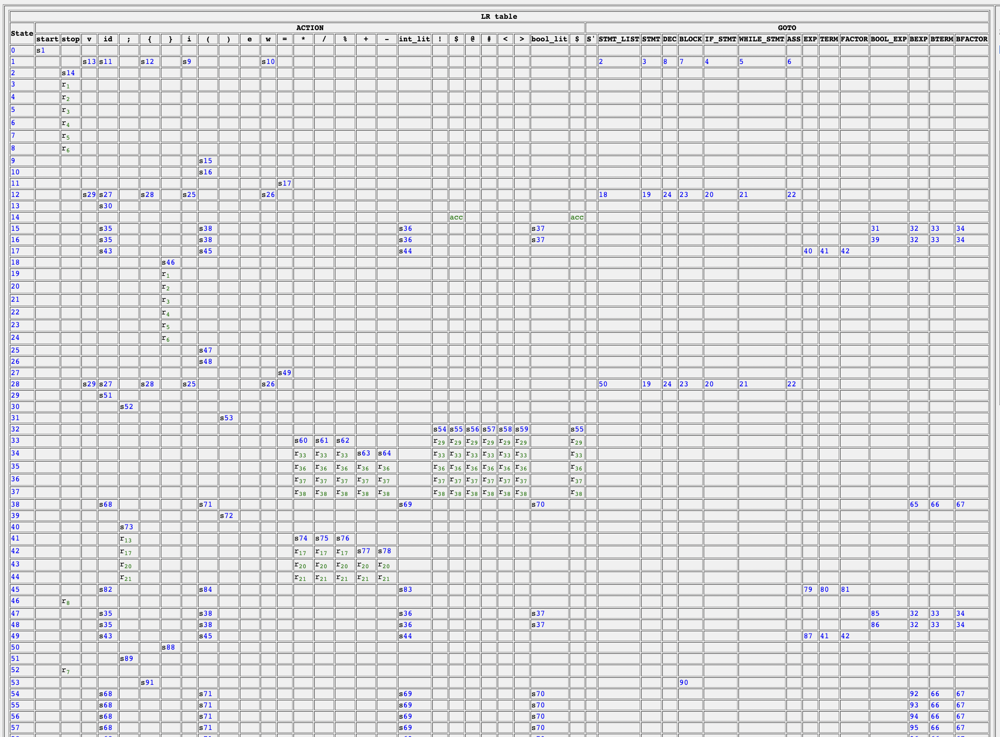
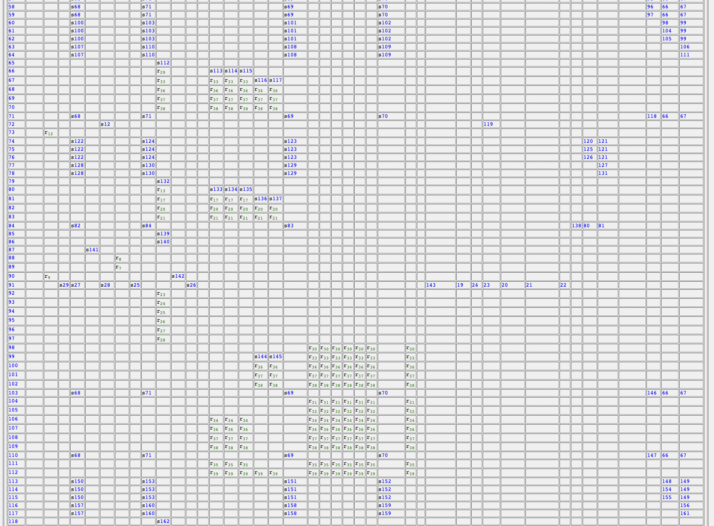
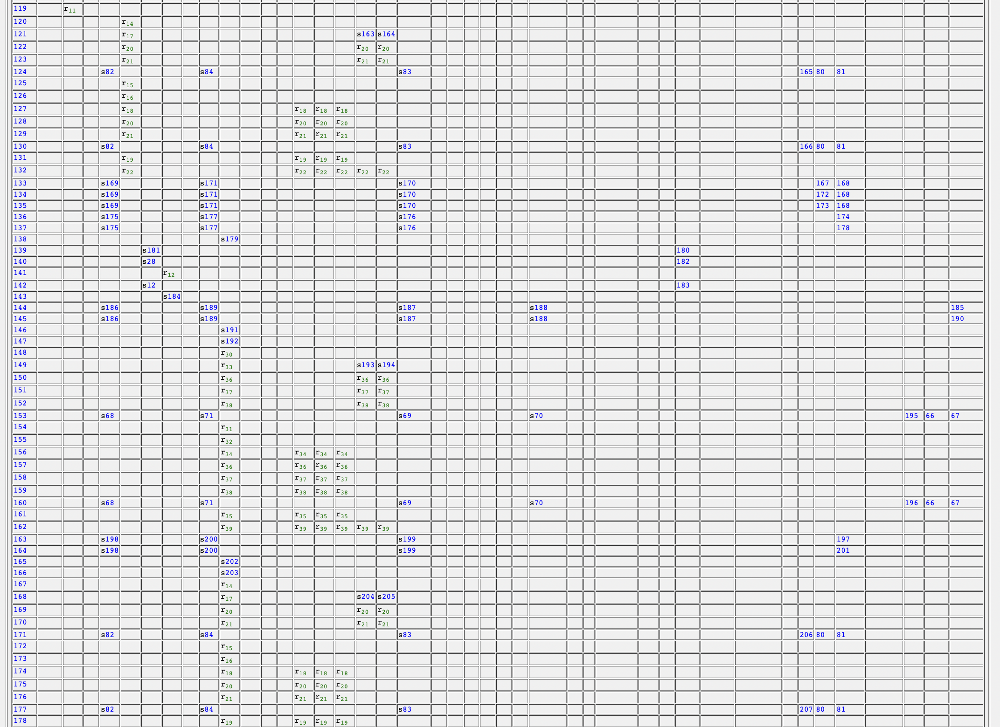
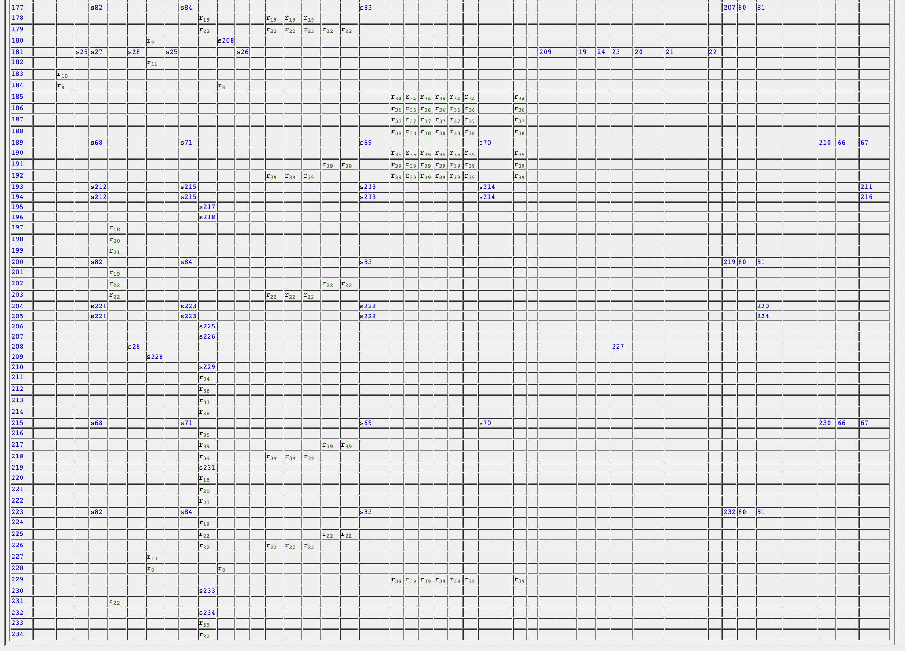

### FIRST TABLE:
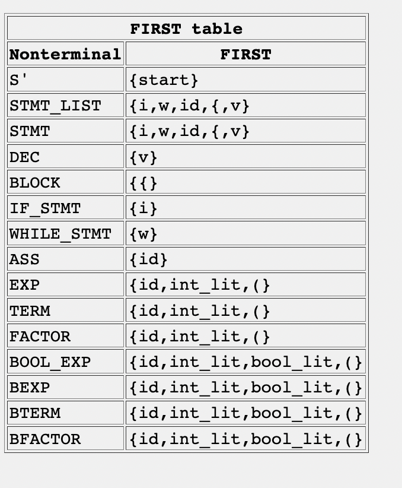

### Code sample 1:
(this code works)
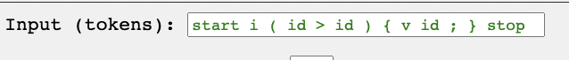
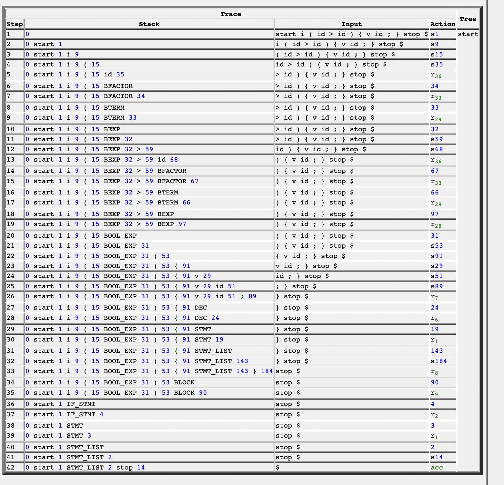

### Code sample 2:
(this code works)
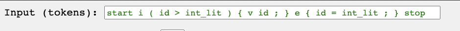
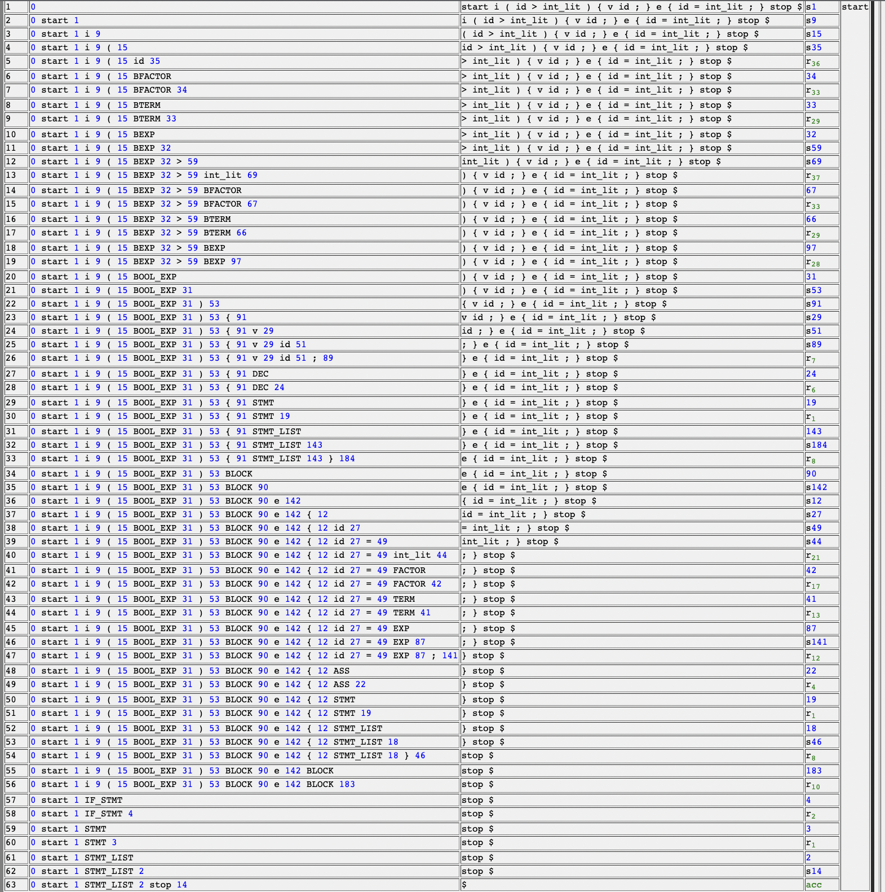

### Code sample 3:
(this code has an error)

#### Explanation:
This code breaks because there is an extra closing parenthesis after “int_lit” that never was opened with an opening parenthesis, which should have come after w ( . So for the code to work it should have been “w ( ( id > int_lit ) )”
It breaks on step 72, because there is no rule or path to go from a closing parenthesis at step 72 so it fails there.

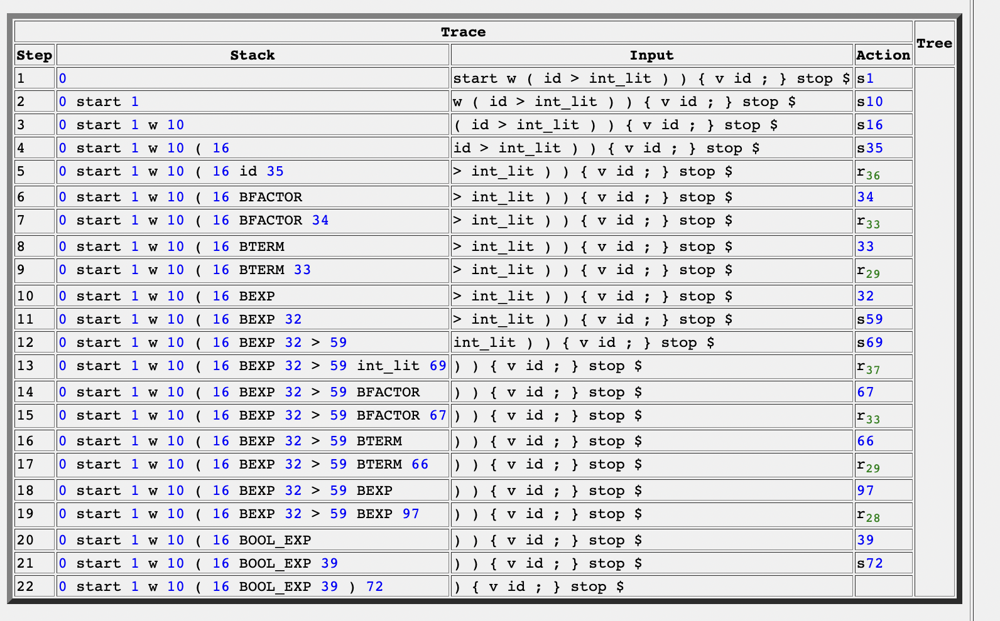

### Code sample 4:
(this code has an error)

#### Explanation:
This code breaks the same way as the above code in that there is a closing parenthesis in the if statement that was never opened before the bool expression begins. This code breaks on step/path 53 because at 53 there is no rule or path to follow if the next character is a closing parenthesis. To correct the code block it should have been “i ( ( id > int_lit + int_lit ) )”

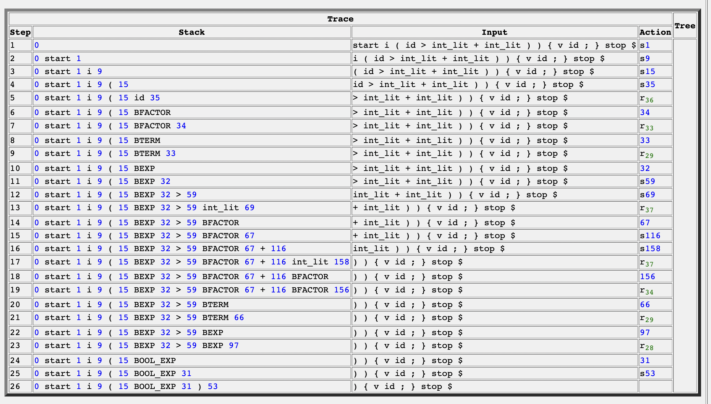

